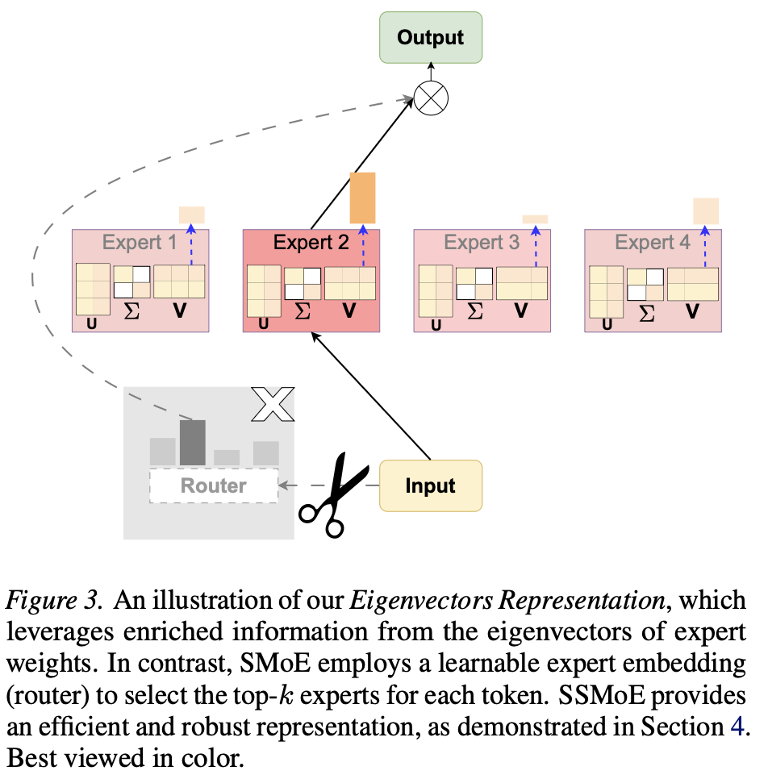

# SSMoE

Code release for the ICML paper **"Eigenvectors of Experts are Training-free Non-collapsing Routers"**.

<p align="center">
  
</p>

## Abstract

Sparse Mixture of Experts (SMoE) architectures improve the training efficiency of Large Language
Models (LLMs) by routing input tokens to a selected subset of specialized experts. Despite their
remarkable success, both training and inference in SMoE models suffer from the expert collapse issue
(Chi et al., 2022), which degrades model performance. Prior studies primarily focus on improving the
router; however, such methods rely on training from scratch or fine-tuning, which requires high
computational and data-processing costs. Furthermore, we demonstrate that, despite these efforts, the
issue persists when advancing well-pretrained SMoE models, as evidenced by both theoretical and
empirical results. To fill that gap, we analyze the advanced SMoE models and observe that the
eigenvectors of expert weight matrices encode rich semantic information, pointing to an effective
alternative to conventional routing strategies. Building on this insight, we propose Singular Value
Decomposition SMoE (SSMoE), a novel and training-free framework that leverages spectral properties
of the expert weights to address the collapse issue and enhance model performance. Extensive
experiments across diverse language and vision tasks, under both clean and corrupt data settings,
demonstrate the strong generalization and robustness of SSMoE. Our findings highlight how a deeper
understanding of model internals can guide the development of more effective SMoE architectures.

## Overview

This repository contains the language and vision experiments used in the paper:

- `SSMoE/Language/SSMoE-Embedding`: MoE language-model embedding evaluation on MTEB.
- `SSMoE/Vision/CLIP-SSMoE`: CLIP-MoE retrieval and classification evaluation.

## Repository Layout

```text
SSMoE/
|-- Language/
|   `-- SSMoE-Embedding/
|       |-- eval_mteb.py          # MTEB evaluation entry point
|       |-- moee.py               # MoE embedding wrapper
|       |-- run_exp.sh            # Batch script for OLMoE experiments
|       |-- olmoe.sh              # OLMoE task/embedding sweep
|       |-- models/               # SSMoE-enabled MoE model implementations
|       `-- mteb/                 # Local MTEB copy used by the experiments
`-- Vision/
    `-- CLIP-SSMoE/
        |-- clipmoe/              # CLIP-MoE model code with SSMoE routing
        |-- eval/                 # Retrieval and classification evaluation
        |-- train/                # Training/inference utilities inherited from CLIP-MoE
        `-- demo.py               # Minimal image-text inference example
```

## Setup

The language and vision code paths use different dependency stacks, so separate environments are recommended.

### Language Embedding Experiments

```bash
cd SSMoE/Language/SSMoE-Embedding
conda create -n ssmoe-lang python=3.10 -y
conda activate ssmoe-lang

# Install PyTorch for your CUDA version first if needed:
# https://pytorch.org/get-started/locally/
pip install torch transformers bitsandbytes scikit-learn numpy tqdm datasets
```

The code loads pretrained MoE checkpoints from Hugging Face. The main tested models are:

- `allenai/OLMoE-1B-7B-0924`
- `Qwen/Qwen1.5-MoE-A2.7B`
- `deepseek-ai/deepseek-moe-16b-base`

### Vision Experiments

```bash
cd SSMoE/Vision/CLIP-SSMoE
conda create -n ssmoe-clip python=3.8 -y
conda activate ssmoe-clip

conda install --yes -c pytorch pytorch=1.7.1 torchvision cudatoolkit=<your-cuda-version>
pip install ftfy regex tqdm
pip install git+https://github.com/openai/CLIP.git
pip install -e .
```

Download the CLIP-MoE checkpoint from [MajorDavidZhang/CLIP-MoE](https://huggingface.co/MajorDavidZhang/CLIP-MoE/tree/main), then update the checkpoint path in the relevant evaluation script under `eval/`.

## Usage

### Run Language MTEB Evaluation

Run the default OLMoE sweep:

```bash
cd SSMoE/Language/SSMoE-Embedding
bash run_exp.sh
```

Run one task group manually:

```bash
python eval_mteb.py \
  --base_model allenai/OLMoE-1B-7B-0924 \
  --use_4bit \
  --task_types STS \
  --batch_size 128 \
  --emb_info RW \
  --embed_method prompteol
```

Important options:

- `--task_types`: MTEB task group, such as `STS`, `Classification`, `Clustering`, `PairClassification`, `Reranking`, or `Summarization`.
- `--emb_info`: embedding source. Use `HS` for hidden states, `RW` for routing weights, or `MoEE` for concatenated features.
- `--embed_method`: prompt format, such as `none` or `prompteol`.
- `--do_pca --pca_dim <dim>`: optional PCA projection.

SSMoE router settings are defined in the model configuration files under `SSMoE/Language/SSMoE-Embedding/models/`:

- `use_svd`: enable or disable SSMoE routing.
- `c`: interpolation ratio between the SSMoE router and the original MoE router.
- `k`: number of candidate eigenvectors used by the SSMoE router.

Results are written under `mteb_results_ablation_test1/`.

### Run Vision Evaluation

Image-text retrieval on COCO:

```bash
cd SSMoE/Vision/CLIP-SSMoE
bash eval/retrieval/run_coco.sh
```

Image classification on CIFAR-10:

```bash
cd SSMoE/Vision/CLIP-SSMoE
bash eval/classification/cifar/run_cifar10.sh
```

For COCO, Flickr30K, ImageNet, CIFAR, and STL-10, prepare datasets following the CLIP-MoE evaluation protocol and update local dataset/checkpoint paths in the corresponding scripts.

## Notes

- Large model checkpoints and datasets are not included in this repository.
- Some evaluation scripts contain machine-specific paths from the original experiments. Update them before running on a new machine.
- The first SSMoE forward pass computes and caches expert eigenspace features inside the model object.

## Acknowledgements

This code builds on the following projects:

- [CLIP-MoE](https://github.com/OpenSparseLLMs/CLIP-MoE)
- [OpenAI CLIP](https://github.com/openai/CLIP)
- [MTEB](https://github.com/embeddings-benchmark/mteb)

## Citation

If you use this code, please cite our paper. BibTeX will be added after the camera-ready metadata is available.
